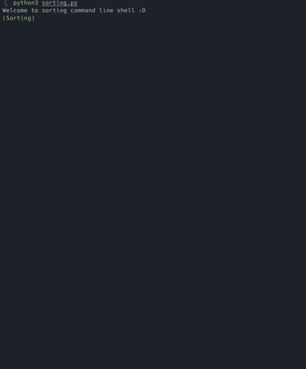

# sorting

Visualize the process of sorting algorithms simply

## Run
1. Clone this repository to your machine
2. Just `python3 sorting.py`

## Usage commands
There are very few commands.

* **create** \< length of list \> : Create list with given length.
* **mergesort** : Sort the list using mergesort algorithm.
* **heapsort** : Sort the list using heapsort algorithm.

## Supported Sorting Algorithms
* MergeSort
* HeapSort
* QuickSort (not implementd yet)
* BubbleSort (not implementd yet)
* InsertionSort (not implementd yet)
* SelectionSort (not implementd yet)

## Contribution
Welcome any contributions of new sorting algorithms

You should just follow the PEP8!
